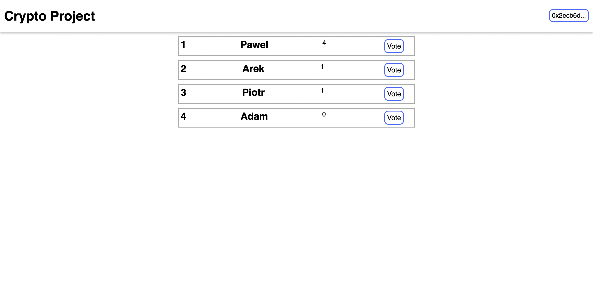

# Voting - Dapp

Here you can cast your votes for individual candidates. All data is downloaded from the blockchain.                                                               The smart contract is attached to the project. You can use it on ropsten network.

The application is integrated with the metamask.

